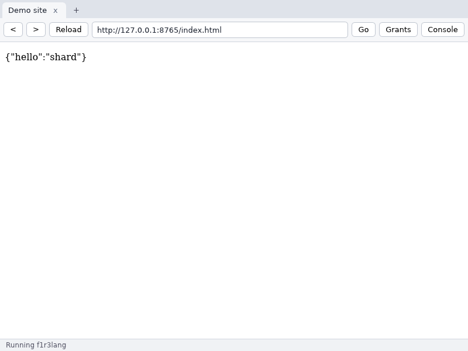

# F1R3Gaze

A browser whose only execution mechanism is f1r3lang on a native RSpace.
HTML and CSS are rendered by [Blitz](https://github.com/DioxusLabs/blitz);
everything a page *does* is a f1r3lang program run by the CampF1R3 executive
in the tab. No JavaScript is ever executed. Pages hold capabilities, not
ambient authority, and sites published on a F1R3FLY shard are resolved and
verified through the shard bridge.

This repository implements the *F1R3Gaze Implementation Specification* v0.1
(`publications/f1r3gaze`): the portable core, the native browser (P1–P3), the
signed installers of P4, and the reach tier.



## Using it

```
f1r3gaze [URL]                      open a window (default: gaze://newtab)
f1r3gaze --headless URL [--allow] [--click SELECTOR]... [--timeout SECS] [--wait SECS] [--log FILE.gzlog]
                                    run a page without a window; print its committed
                                    document and console (CI smoke tests)
f1r3gaze --profile DIR ...          use DIR as the profile (also: F1R3GAZE_PROFILE)
f1r3gaze wallet new|import|export|use|list|balance|send|remove ...
                                    the wallets that pay for deploys (docs/wallet.md)
f1r3gaze chain block HASH | blocks [N] | find-deploy ID | finalized HASH
               | pool | caps | shards     [--json]
f1r3gaze pos status | delegations KEY | bonds | validators | trusted
                                             [--json]
                                    read the chain and its staking state
                                    (the rchain dialect only)
f1r3gaze site publish DIR f1r3://<pub>/<proj>@<range>
               [--entry NAME] [--mirror URL]...
                                    publish a site's manifest to the shard and
                                    read it back (the rchain dialect only)

f1r3c compile app.rho [-o app.knf] [--level k1g] [--import IDENT=URN]...
f1r3c inspect app.knf               manifest, hashes, program text
f1r3c integrity app.knf             value for the HTML integrity attribute
f1r3c site DIR [--entry index.html] [--mirror URL]... [--out OUT]
                                    package a site: blobs by hash + the registry manifest
```

A page loads its behaviour like this, and the browser refuses it if the
bytes do not match:

```html
<script type="application/f1r3lang" src="app.knf" integrity="blake2b-256:420d…"></script>
```

or inline, naming the capabilities it imports:

```html
<script type="application/f1r3lang" imports="doc">
  new found, sub, clicks in {
    doc!("query1", "#lamp", *found) |
    for (@("ok", *lamp) <- found) { lamp!("listen", "click", *clicks, {}, *sub) | … }
  }
</script>
```

Addresses: `https://…` and `http://…` (plain HTTP can be switched off),
`f1r3://<publisher>/<project>@<range>/<path>` for shard sites,
`f1r3h://blake2b-256/<hex>` for content by hash, `file://…`, and the
built-in `gaze://newtab` and `gaze://about`.

Settings live in `settings.conf` in the profile directory
(`~/Library/Application Support/F1R3Gaze`, `%APPDATA%\F1R3Gaze`,
`$XDG_DATA_HOME/f1r3gaze`): shard observers, the validator, the shard id,
the quorum, blob mirrors, `https_only`, and for the wallet `embers_api` and
`max_fee`.

### The wallet: the agent driving the browser pays

Every deploy the browser makes (a page's program, a session message) is
signed by the **active wallet**, whose account pays for it. Wallets are
created, imported and exported in the same file format as **F1R3Sky**, and
their addresses are the F1R3Cap addresses F1R3Sky shows. Keys live in the OS
keychain (macOS, Windows) or a `0600` file per key (Linux).

A program deployed under the user's key could otherwise take the deployer's
identity and spend from the wallet, so the browser renders every deploy
itself and binds only allow-listed system names: registry, standard output,
the deploy id, block data, crypto. **`rho:rchain:deployerId` is refused.** A
page can cost phlo (the consent prompt quotes it, with the paying wallet and
its balance); it cannot move funds. Transfers go through Embers, as in
F1R3Sky, but the browser decodes and checks every prepared contract against
Embers' transfer template before signing it. (On the rchain dialect they go
through the node's native `rho:rchain:revVault` instead -- see *Node dialects*.)
Details: `docs/wallet.md`.

### Events

A listener receives `(type, fields)`. `docs/events.md` lists the fields
guaranteed for each event type; hosts may add more, so pages end their
patterns with a remainder: `@(_, {"x": x, "y": y ..._})`.

## Building

```
cargo build --release -p gaze-shell -p f1r3c     # target/release/{f1r3gaze,f1r3c}
cargo test --workspace
cargo build -p gaze-reach --target wasm32-unknown-unknown --profile reach
```

Rust 1.91, edition 2024. CampF1R3 (`gaze/map-remainders`, rev `ea2d323`) and
Blitz (rev `674d7d2`) are git dependencies pinned by revision; the CampF1R3
revision must be pushed to GitHub before a clean checkout can build. On Linux the
window needs Vulkan (or Mesa's `lavapipe`, `mesa-vulkan-drivers`) and
`libxkbcommon`; macOS and Windows need nothing extra. Building the windowed
binary in debug mode wants about 4 GB of memory to link.

## Releases (P4)

Pushing a tag `vX.Y.Z` runs `.github/workflows/release.yml`, which builds and
publishes a draft GitHub release with:

| platform | artifacts | signing |
| --- | --- | --- |
| macOS | `F1R3Gaze-<v>-macos-universal.dmg` (arm64 + x86_64) | Developer ID, hardened runtime with **no** exceptions (no JIT entitlement: there is no JavaScript), notarised and stapled |
| Windows | `F1R3Gaze-<v>-x64.msi`, portable `.zip` | Authenticode (`signtool`, SHA-256, RFC 3161 timestamp) on both executables and the MSI |
| Linux | `.deb`, `.AppImage`, `.tar.gz` | GPG-signed `SHA256SUMS` covering every artifact of every platform |

Secrets: `MACOS_CERT_P12`, `MACOS_CERT_PASSWORD`, `MACOS_SIGN_IDENTITY`,
`APPLE_ID`, `APPLE_TEAM_ID`, `APPLE_APP_PASSWORD`; `WINDOWS_CERT_PFX`,
`WINDOWS_CERT_PASSWORD`; `GPG_PRIVATE_KEY`, `GPG_PASSPHRASE`. A platform whose
secrets are missing still builds, unsigned, with a warning. The Windows
installer and the Linux packages register `f1r3://` and `f1r3h://`. Scripts:
`packaging/{linux,macos,windows}/`, icons from the F1R3FLY.io brand kit in
`packaging/icons/`.

Verify a download: `gpg --verify SHA256SUMS.asc SHA256SUMS && sha256sum -c SHA256SUMS`.

## Reach tier

`crates/gaze-reach` compiles the executive and the DOM protocol to one wasm
module (no `wasm-bindgen`); `web/gaze-reach.js` is its host in any modern
browser: the DOM backend over the real page, the frame loop, `net` (same
origin, integrity checked inside the module), `store` (IndexedDB) and `nav`.
`shard` is a dead channel there, since a stock browser has no key custody a
page cannot reach. `.github/workflows/reach.yml` publishes the module and the
demo page to GitHub Pages. A page opts in with

```html
<script type="module" src="gaze-reach.js"></script>
```

## Crates

| crate | spec | contents |
| --- | --- | --- |
| `gaze-graded` | §10 | the four integer semirings, xoshiro256**, argmax / argmin / proportional sampling, the ψ ⊕ ε fairness combinator, ceilings |
| `gaze-knf` | §5 | the `.knf` container, the manifest, program and grant hashes, `integrity` strings |
| `gaze-dom-core` | §7 | the DOM protocol engine over `DomBackend`; attenuation, verbs, fragments, frame-batched writes, capture/bubble dispatch, `decide` listeners; `MemDom` reference backend |
| `gaze-exec` | §6, §8 | `TabExec`: grounding, apertures, `doc`/`log`/`clock`/`rand`, external capabilities routed out as requests, the frame loop, the page meter, `.gzlog` record and replay (dispatches included) |
| `gaze-dom-blitz` | §7.9, WP B1 | `BlitzDom` backend, `RhoDocument` (a Blitz `Document`: script collection, frame pacing, services), `RhoEventHandler` |
| `gaze-broker` | §8.4, WP C2 | sites, the default policy, grant plans and prompts, remembered grants, per-tab routes with attenuation, revocation |
| `gaze-net` | §8.5 | HTTP without ambient credentials, per-hop redirect checks, schemes, content hashes, the Blitz net provider |
| `gaze-store` | §8.6 | per-origin append-only store with quota and torn-tail recovery |
| `gaze-blob` | §9.7 | content-addressed blobs: verifying cache, mirrors |
| `gaze-shard` | §9, WP S1/S2 | the shard bridge: deploys signed by the payer, node client, graded answers (node, quorum), freshness, code-by-hash rendering with the system-name allow-list, sessions, watches, site manifests, on-chain blobs in F1R3Drive's layout, the keystore |
| `gaze-wallet` | — | wallets: F1R3Cap addresses, F1R3Sky-compatible key files, Embers balances and transfers with prepared contracts checked before signing; the bridge's payer |
| `gaze-shell` | §3, WP C1 | the application: engine, tab pipeline, chrome, headless runner, profile |
| `f1r3c` | §3 | the toolchain CLI |
| `gaze-reach` | §12 | the reach tier |

## Upstream changes to CampF1R3 (in `patches/`)

- **U1 ground data.** Booleans, 64-bit integers, strings, bytes, lists, tuples
  and maps through lexer, parser (level `K1G`), AST, normaliser, encoding
  (tags `0x09`–`0x0F`), decoding, substitution, JSON, printer and matcher.
  Maps are ordered by key encoding; duplicate literal keys are rejected.
- **U3** `Machine::with_observer`, and `Observer::observe_aperture`.
- **U4** `bind_aperture`, `take_outbound`, `inject`.
- **U6** the `Keyed` minter.
- A job whose cut an observer refuses is put back at the head of the queue,
  so an exhausted budget stops progress without losing work.
- **Remainder patterns** for lists and maps (branch `gaze/map-remainders`,
  commit `ea2d323`, offered as input to the map-pattern design):
  `[a, b ...rest]`, `{"k": v ...rest}`. A map pattern matches by key lookup;
  keys must be ground. See the commit message for the full design.

Three defects in the existing code were found and fixed on the way:

1. Substitution reversed the arguments of a polyadic send (`rebuild.rs`).
2. The matcher bound a name pattern to the raw quote `@P` instead of applying
   `@*x = x`, so a received name could not be sent on. The rewrite was missing
   at three sites: the `*y` process pattern, the datum-to-name goal, and
   `Chan::quote`.
3. A quoted pattern `@{*y}` could not match a concrete (unforgeable) name.


## Tests

110 tests in this workspace, all passing — six of them env-gated live tests
against a running `rnode` (CampF1R3 carries its own 181):

| crate | tests | what they establish |
| --- | --- | --- |
| `gaze-exec` | 9 | the specification's lamp; replay with identical commit hashes; seeds; dead channels; confinement; timers; bounded runaway pages; a remainder listener survives extra event fields where an exact one goes silent |
| `gaze-dom-core`, `gaze-graded`, `gaze-knf` | 16 | the protocol engine, the semirings, the container |
| `gaze-dom-blitz` | 7 | Blitz and `MemDom` commit identical hashes frame by frame; a Blitz log replays identically on both, including a click on a never-named node; scoped queries cannot leak; `decide` prevents; `setHTML` |
| `gaze-broker` | 5 | policy, prompts, remembered grants, routes, revocation |
| `gaze-net`, `gaze-store`, `gaze-blob` | 10 | redirects, credentials stripped, hashes; torn-tail recovery and quota; verified cache |
| `gaze-shard` | 11 | the deploy preimage matches `prost`; signatures verify; against mock nodes: a lying observer is outvoted, a split is an error, a rollback is stale, nothing is deployed before consent, and the body the validator receives verifies |
| `gaze-wallet` | 5 | addresses, wallet files and signature bytes identical to the Embers SDK's own output; the contract check refuses a changed recipient, amount or note, smuggled code, hidden fields, a high fee or another shard; wallets kept, exported, switched; transfers through an honest mock Embers, and nothing signed for a dishonest one |
| `gaze-reach` | 3 | the reach tier commits exactly the native executive's hashes for the same page and clicks; integrity; `shard` is dead |
| `gaze-shell` | 1 | settings |

End-to-end, on the real binary:

- the new-tab page's f1r3lang lamp toggles on a click;
- a site's `.knf` is fetched by `src`, integrity-checked, fetches over `net`,
  writes and reads `store`, logs, and saves a replay log; a tampered copy is
  refused with "integrity mismatch";
- in the window (Linux, Xvfb, Vello on lavapipe): tabs, the address bar with
  typed navigation, the console and grants panels, and a real click handled
  by the page — screenshots in `docs/screenshots/`;
- the wallet, through the whole stack against a mock node: a page's deploy is
  quoted naming the paying wallet, signed by it, and finalized; a program
  asking for `rho:rchain:deployerId` is refused before anything reaches the
  node; a wallet file in F1R3Sky's format imports and exports byte for byte;
- in the window: the wallet panel lists wallets with balances from Embers,
  switches the paying wallet, and sends a transfer after a confirming click
  (screenshots 06–08);
- the `.deb` installs and runs, the AppImage runs, and the signed checksums
  verify (and fail on a changed byte).

## Deviations from the specification, for review


- **Ground values** are two node variants, `Lit` and `Coll` (a map's items
  alternate key and value), not one `Ground(Lit)`.
- **Authority of names.** A name obtained through another name inherits its
  root, so a page can navigate its own document (`parent`, `closest`). A new
  verb, `attenuate`, mints a name rooted at its own node; that is the name a page
  hands to a component to confine it. The specification's literal rule (every
  name rooted at itself) would make `parent` useless.
- **Commit hash.** The hash recorded per frame is of the committed document's
  serialisation, not of the write batch.
- **One executive per window thread.** Each tab's executive runs on the
  window thread, paced to 16 ms in the foreground and 250 ms in the background,
  rather than on a worker per tab.
- **The chrome is Rust-driven HTML.** Making it a f1r3lang page with a
  privileged capability is K1 (P4) work.
- **The bridge speaks the node's HTTP API** (`/api/deploy`, `/api/registry`,
  `/api/explore-deploy`, `/ws/events`) rather than Embers' gRPC
  `firefly-client`, which needs `protoc` and `tonic` at build time. Deploys are
  byte-for-byte what the node verifies.
- **Linux keys** are in a `0600` file in the profile; macOS and Windows use
  the OS keychain (`os-keyring`, on in release builds).
- **One wallet signs for every site** (the spec's per-site keys are gone:
  the account that pays is the deployer). Sites can therefore link a user's
  deploys; users who want separate identities keep several wallets. Session
  keys remain as session identities but no longer sign.

## Node dialects: f1r3fly and rchain

The bridge speaks to two node implementations, chosen by `dialect` in
`settings.conf`:

```
dialect = f1r3fly   # F1R3FLY's f1r3node-rust (the default)
dialect = rchain    # rchain-rust's rnode
```

The deploy wire is the same on both — the same `DeployDataProto` fields, the
same DER secp256k1 signature over the BLAKE2b-256 prehash, the same
`deployer`/`signature`/`sigAlgorithm` JSON — so a deploy signed for one is what
the other verifies, except for proto field 13 (`expiration_timestamp`), which
only f1r3fly defines and which is omitted for rchain. The F1R3Cap wallet
address is likewise rnode's REV address, byte for byte.

The read surface differs, and the rchain dialect adapts rather than moving the
node:

| | f1r3fly | rchain |
|---|---|---|
| registry | `GET /api/registry/{uri}` | read the manifest as data on a public channel named by the same `rho:serve:1:…` string |
| explore | `POST /api/explore-deploy` `{"term":…}` | `POST /api/explore-deploy-by-block-hash` `{term, blockHash, usePreStateHash}` |
| cost estimate | `POST /api/estimate-cost` | none: the prompt quotes the configured bound ("up to `phlo_limit`") |
| deploy status | `GET /api/deploy-finalization-status/{sig}` | `GET /api/v1/deploy-status/{sig}`, a tagged enum |
| finality events | `block-finalised` on `/ws/events` | none: the anchor block is polled |
| shard id | `root` | `/root` |
| wallet balance | Embers `state` | `revVault!("getBalance", addr, *ret)` through an exploratory deploy |
| wallet transfer | an Embers prepared contract | `revVault!("transfer", *deployerId, to, drops, *ret)`, as a deploy |
| faucet | Embers | `POST /api/faucet {address}` |
| chain reads | — (no counterpart) | `block` / `blocks` / `deploy` / `is-finalized` / `deploys` / `capabilities` / `shards` |
| staking reads | — (no counterpart) | `/api/v1/pos`, `/api/v1/pos/delegations`, and the read-only `rho:rchain:pos` methods |
| staking writes | — (no counterpart) | `bond` / `withdraw` through the native `rho:rchain:pos`, on the payer's own key |
| delegation | — (no counterpart) | `delegate` / `undelegate` on a **named** operator, through the native `rho:rchain:pos` |
| site publishing | `rho:registry:insertSigned` | `@"rho:serve:1:…"!(manifest)` plus the files in F1R3Drive's on-chain layout, as deploys |

Two things are lost on rchain, and are dialect-scoped rather than papered over:

- **A measured deploy cost.** rchain has no estimate endpoint, so the consent
  prompt quotes a bound (`phlo_limit`, default 250000) instead of a price.
- **Wallet transfer history.** Balances, REV transfers and the devnet faucet
  work on both dialects -- on rchain through the node's native
  `rho:rchain:revVault` (`getBalance` / `transfer`), on f1r3fly through Embers.
  What rchain has no counterpart for is Embers' *server-side history*, so
  `embers_api` stays f1r3fly-only and `f1r3gaze wallet balance` prints a bare
  balance there.

A single-validator `rnode` proposes blocks but never finalizes, so
`/api/last-finalized-block` answers 400; the rchain dialect falls back to the
newest block from `/api/blocks` as its anchor. On a net that does finalize, the
fringe is used.

The chain and staking reads are the mirror image of the two losses above: they
are **rchain-only**. f1r3fly has no counterpart for them, so `f1r3gaze chain`
and `f1r3gaze pos` refuse there and a page's `chain!` verb answers
`("err","unavailable",…)`. Nothing rchain-shaped is ever put on the wire — the
f1r3fly arms are written so they do not call the HTTP layer at all, and a test
asserts the node's request log stays clean.

A page reaches the reads through one `chain!` verb, `chain!("block", HASH, ret)`
and so on, which is its own consent class ("wants to read the chain"), asked for
once per site and never granted with the shard itself. The staking writes are the
same shape under a second class, `stake!`: a page names an *amount*, never a key,
so it can lock the payer's REV or stage an unbond and nothing else — it cannot
send funds anywhere or touch another key, which is what makes exposing it
defensible. Delegation is a **third** class, `delegate!`, because it is the one
write that names a key: a site trusted to bond or unbond the payer's own stake is
not thereby trusted to nominate who holds it, so the class is asked for
separately and the prompt says whose keys are in play. A refusal is not a
failure: the deploy succeeds and the program
declines, so the node's reason is read back from the deploy's own
`rho:rchain:deployId` and reported as `("err", "refused", reason)`.

**Publishing a site** is the other half of the same seam. On f1r3fly a manifest
lives in the registry; on rchain it is data on the public channel its address
names, so `f1r3gaze site publish DIR f1r3://<pub>/<proj>@<range>` deploys the one
send that puts it there and then reads it back. **The address is portable** —
`rho:serve:1:…` is the registry URI on one dialect and the channel name on the
other — but a site published on f1r3fly must be **re-published** on rchain, since
the writer differs even though the address does not. The site's **files** go
on-chain too, in F1R3Drive's layout under the root this client's own reader
watches, so a published site needs no mirror — and the command ends by fetching
the entry back through that path, so it fails unless the site actually *loads*.
Files over 256 KiB still need a mirror: the layout caps there, and a truncated
blob would pass its own hash check. A channel accumulates, so re-publishing
unchanged content is
harmless (identical copies are one answer) while re-publishing *changed* content
at one address is refused — a changed site takes a new range (`@^1` to `@^2`).

Proven live: `crates/gaze-shard/tests/rchain_live.rs` deploys a program this
crate signs against a running `rnode` and checks the node's reported deploy id
against the signature, then reads a REV balance, moves REV, and funds from the
faucet. Set `RCHAIN_NODE` and `RCHAIN_DEPLOYER_KEY` to run it.

## Not in this release

- U2 guards and U5 (the resolver seam): K2 and graded pages are refused at
  load, naming the work package.
- The `proof` rung (node work package N1) and the `replayed` rung: they answer
  `("err", "unavailable", …)`.
- `rho:serve` resolution depends on the VersionedRegistry step 6 on the node.
- Legacy JavaScript tabs, devtools time travel, the gateway.
- Opening `f1r3://` links from other macOS apps (Apple-event URL handling).
- Authenticating session messages to their service (a signed-message
  scheme verified on chain); today a session is identified, not proven.
- A `pay` capability for pages (a payment request the user approves in the
  wallet); pages cannot initiate transfers.
